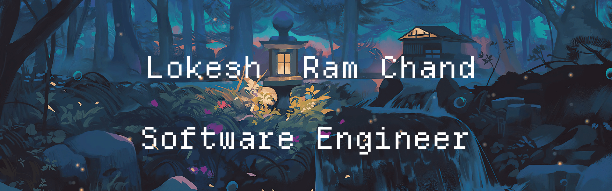

<!--

  
-->

  

<table>
  <tr>
    <td width="60%" style="vertical-align: top; padding-right: 20px;">
      

        <h3 style="margin-bottom: 10px; font-size: 20px; color: #333;">About Me</h3>
        

          I am a 3rd-year Computer Science and Engineering student with a passion for building impactful applications using Flutter, Node.js, and AI.  
          I enjoy exploring new technologies, solving challenging problems, and turning ideas into functional products.  
          Driven by curiosity and a desire to innovate, I aim to create software that makes a meaningful difference in the world.
        

      

    </td>
    <td width="40%" height="40%" style="vertical-align: top;">
      
    </td>
  </tr>
</table>

### **⚡ Tech Stack**  

### **💻 Languages & Frameworks**  
 

### **🌍 Let's Connect**  

   &nbsp;
   &nbsp;
   &nbsp;
  

<!--
## **🏆 GitHub Hall of Fame**  

  

  

 

---

## **💬 Developer Wisdom**  

  
  &nbsp; &nbsp;
  

 

  

-->
